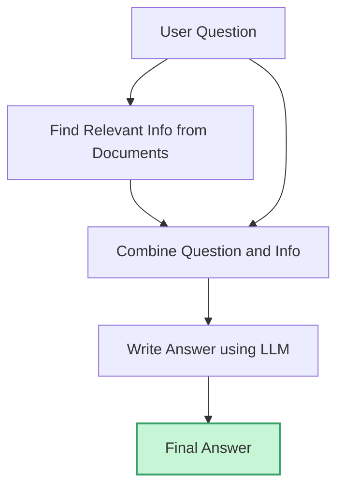

# Getting Started with LLMs and RAG: My First Week in LLM Zoomcamp 2025

## Table of Contents
- [Introduction](#introduction)
- [RAG Architecture](#rag-architecture)
- [Setting Up the Environment](#setting-up-the-environment)
- [Step 1: Downloading and Indexing Documents](#step-1-downloading-and-indexing-documents)
- [Step 2: Running-and-Connecting-to-elasticsearch](#step-2-running-and-connecting-to-elasticsearch)
- [Step 3: Searching Documents with ElasticSearch](#step-3-searching-documents-with-elasticsearch)
- [Step 4: Generating Answers with OpenAI](#step-4-generating-answers-with-openai)
- [Putting It All Together](#putting-it-all-together)
- [Sample Query and Output](#sample-query-and-output)
- [Resources](#resources)

---

## Introduction

Ever since [ChatGPT](https://openai.com/blog/chatgpt) was released in November 2022, the tech industry has changed in ways we have never seen before.
At the heart of this revolution is Large Language Models (LLM).
You can think of an LLM as a robot that has read millions of books and articles, and tries to answer your questions as best as it can.

But even the smartest robot has its limits.
If you ask about something that happened after its last big update, it will not know the answer.
Robots cannot keep up with the latest news unless you update their memory.
If you ask about something very specific to your situation, the robot can only guess, because it does not know your personal details or the latest changes unless you tell it.
Sometimes, without the right context, the robot’s answers might be too general, or it might even make up something that sounds right but is not actually true.

This is where Retrieval-Augmented Generation (RAG) comes in.
RAG gives our robot a new ability.
Before answering, it can quickly search through up-to-date documents, websites, or databases to find the most relevant and current information.
With RAG, the robot’s answers become not just smart, but also accurate and tailored to your needs.

---

## RAG Architecture

Before diving into the hands-on part, let’s take a look at how RAG works at a high level.
Understanding the architecture will help you see how each component fits together in the workflow.

RAG is made up of two main parts:

1. **Retrieval:** Like a search engine, it looks through a collection of documents to find the most relevant information for your question.
2. **Generation:** This part takes your question and the information found by the retriever, and then creates a helpful answer.

### RAG Workflow Diagram

Below is a simple diagram showing the flow of information in a RAG system:



In the first week of [LLM Zoomcamp](https://github.com/DataTalksClub/llm-zoomcamp), we implemented this workflow step by step.

---

## Setting Up the Environment

To get started, you need a development environment that is easy to set up and ready for experimentation.
For this course, I wanted a setup that was quick and hassle-free. Instead of installing everything locally, I used [GitHub Codespaces](https://github.com/features/codespaces).
This allowed me to spin up a development environment in the cloud, with all the necessary tools pre-installed.
I could write and run code directly in the browser, and even run Docker containers without any issues.
All of the code in this lesson can be run in **Jupyter Notebook**.

**Installing libraries:**  
Here are the main Python libraries you’ll need for this project:

```bash
pip install tqdm notebook==7.1.2 openai elasticsearch==8.13.0 pandas scikit-learn ipywidgets
```

---

## Step 1: Downloading and Indexing Documents

The first step in building a RAG system is to gather the documents you want your model to search through.  
In this project, we use a set of course-related documents.

Here’s how to download and prepare the documents:

```python
import requests 

docs_url = 'https://github.com/alexeygrigorev/llm-rag-workshop/raw/main/notebooks/documents.json'
docs_response = requests.get(docs_url)
documents_raw = docs_response.json()

documents = []

for course in documents_raw:
    course_name = course['course']

    for doc in course['documents']:
        doc['course'] = course_name
        documents.append(doc)
```

---

## Step 2: Running and Connecting to ElasticSearch

Now that we have our documents, we need a way to search through them efficiently.  
[ElasticSearch](https://www.elastic.co/elasticsearch/) is a powerful search engine that lets us quickly find relevant information from large collections of text.

First, start ElasticSearch using Docker:

```bash
docker run -it \
    --rm \
    --name elasticsearch \
    -m 4GB \
    -p 9200:9200 \
    -p 9300:9300 \
    -e "discovery.type=single-node" \
    -e "xpack.security.enabled=false" \
    docker.elastic.co/elasticsearch/elasticsearch:8.4.3
```

Next, connect to ElasticSearch from Python:

```python
from elasticsearch import Elasticsearch

es_client = Elasticsearch("http://localhost:9200")
```

You can check if ElasticSearch is running properly with:

```python
es_client.info()
```

If the output is something like below, it is working:

```
ObjectApiResponse({'name': '...', 'cluster_name': 'docker-cluster', ...})
```

Now, let’s index our documents so they can be searched:

```python
index_settings = {
    "settings": {
        "number_of_shards": 1,
        "number_of_replicas": 0
    },
    "mappings": {
        "properties": {
            "text": {"type": "text"},
            "section": {"type": "text"},
            "question": {"type": "text"},
            "course": {"type": "keyword"} 
        }
    }
}

index_name = "course-questions"

es_client.indices.create(index=index_name, body=index_settings)
```

---

## Step 3: Searching Documents with ElasticSearch

With our documents indexed, we can now search for relevant information based on a user’s question.  
Here’s a function that takes a query and returns the top matching documents from ElasticSearch:

```python
def elastic_search(query):
    search_query = {
        "size": 5,
        "query": {
            "bool": {
                "must": {
                    "multi_match": {
                        "query": query,
                        "fields": ["question^3", "text", "section"],
                        "type": "best_fields"
                    }
                },
                "filter": {
                    "term": {
                        "course": "data-engineering-zoomcamp"
                    }
                }
            }
        }
    }
    response = es_client.search(index=index_name, body=search_query)

    result_docs = []
    for hit in response['hits']['hits']:
        result_docs.append(hit['_source'])

    return result_docs
```

---

## Step 4: Generating Answers with OpenAI

Once we have the relevant documents, we want to generate a natural language answer to the user’s question.  
We use the [OpenAI API](https://platform.openai.com/docs/api-reference/introduction) for this step.

Here’s how to try a simple query with the OpenAI API:

```python
query = 'can I enroll even after the course has been started?'

response = client.chat.completions.create(
    model='gpt-4.1',
    messages=[{'role':'user','content':query}]
)
```

Without any context, the answer will be generic, like:

```
Whether you can enroll in a course after it has started depends on several factors such as the institution's policies, the course format, and the instructor's discretion...
```

---

## Putting It All Together

Now let’s combine everything into a full RAG pipeline.  
We’ll build the context from our search results, create a prompt for the LLM, and generate a final answer.

First, build the context from the search results:

```python
context = ''
for doc in results:
    context += f"section: {doc['section']}\nquestion: {doc['question']}\nanswer: {doc['text']}\n\n"
```

Next, use a prompt template to guide the LLM:

```python
prompt_template = """
    You're a course teaching assistant. Answer the QUESTION based on the CONTEXT. 
    Use only the facts from the CONTEXT when answering the QUESTION.
    If the CONTEXT doesn't contain the answer, output NONE.
    Question: {question}

    CONTEXT:
    {context}
"""

prompt = prompt_template.format(question=query, context=context).strip()
```

Here are some helper functions to make the process reusable:

```python
def build_prompt(query, search_results):
    prompt_template = """
        You're a course teaching assistant. Answer the QUESTION based on the CONTEXT. 
        Use only the facts from the CONTEXT when answering the QUESTION.
        If the CONTEXT doesn't contain the answer, output NONE.
        Question: {question}
    
        CONTEXT:
        {context}
    """.strip()
    
    context = ''
    for doc in search_results:
        context += f"section: {doc['section']}\nquestion: {doc['question']}\nanswer: {doc['text']}\n\n"

    prompt = prompt_template.format(question=query, context=context).strip()
    return prompt
```

```python
def llm(prompt):
    response = client.chat.completions.create(
        model='gpt-4.1',
        messages=[{'role':'user','content': prompt}]
    )
    return response.choices[0].message.content
```

Finally, here’s the main function that ties everything together:

```python
def rag(query):
    search_results = elastic_search(query)
    prompt = build_prompt(query, search_results)
    answer = llm(prompt)
    return answer
```

---

## Sample Query and Output

Let’s see the RAG pipeline in action!  
We’ll use a real question and see how the system responds.

```python
query = 'can I enroll even after the course has been started?'
rag(query)
```

Sample output:

```
"Yes, you can still join the course even after the start date. Even if you don't register, you're still eligible to submit the homeworks. However, be aware that there will be deadlines for turning in the final projects, so don't leave everything for the last minute."
```

---

## Conclusion

So that’s it for the first week. 
Thank you for reading up until this point. I really appreciate it. 
If you’re still here, I guess you’re interested in this topic, and maybe in my writing too!
If you have any questions or just want to chat about LLMs and RAG, feel free to reach out to me at nhatminh2947@gmail.com.

I’m committed to completing the whole LLM Zoomcamp, so stay tuned, there will be another post next week. 

Thank you again, and see you soon!

---

## Resources

Here are some useful links if you want to learn more or try things yourself:

- [LLM Zoomcamp 2025](https://github.com/DataTalksClub/llm-zoomcamp)
- [My LLM Zoomcamp Study Repo](https://github.com/nhatminh2947/llm-zoomcamp)
- [ElasticSearch Documentation](https://www.elastic.co/guide/en/elasticsearch/reference/current/index.html)
- [OpenAI API Documentation](https://platform.openai.com/docs/api-reference/introduction)
- [GitHub Codespaces](https://github.com/features/codespaces)
