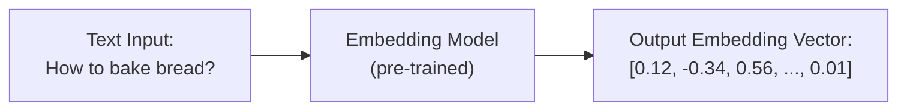

## Table of Contents
- [Introduction](#introduction)
- [What is a Vector?](#what-is-a-vector)
- [How Do We Measure Closeness?](#how-do-we-measure-closeness)
- [From Theory to Practice](#from-theory-to-practice)
- [Step 0: Setup](#step-0-setup)
- [Step 1: Collecting Documents](#step-1-collecting-documents)
- [Step 2: Embedding the Documents](#step-2-embedding-the-documents)
- [Step 3: Initialising QdrantClient](#step-3-initialising-qdrantclient)
- [Step 4: Creating a Collection](#step-4-creating-a-collection)
- [Step 5: Inserting Documents](#step-5-inserting-documents)
- [Step 6: Querying for Answers](#step-6-querying-for-answers)
- [Step 7: Putting It All Together](#step-7-putting-it-all-together)
- [Conclusion](#conclusion)
- [Resources](#resources)

---

## Introduction

In [course 1](https://nhatminh2947.github.io/llm%20zoomcamp%202025/getting-started-with-llms-and-rag-llm-zoomcamp-week1/), we learned how to implement RAG (Retrieval-Augmented Generation) with Elasticsearch. Now, it’s time to step up a notch and explore vector search—a powerful technique for finding relevant information quickly, even in massive datasets.

---

## What is a Vector?

A vector is just an array of numbers. In NLP, we use models (like BERT or sentence transformers) to convert text (sentences, paragraphs, documents) into vectors—these are called embeddings.



These vectors capture the meaning of the text, so similar texts have similar vectors.

---

## How Do We Measure Closeness?

Now that we know what a vector is, how do we measure if two sentences are similar? The most common ways are:

### 1. Cosine Similarity

Cosine similarity measures the angle between two vectors. It ranges from -1 (opposite) to 1 (identical). The higher the cosine similarity, the more similar the meaning.

**Formula:**
```
cosine_similarity(A, B) = (A · B) / (||A|| * ||B||)
```
Where `A · B` is the dot product of vectors A and B, and `||A||` is the magnitude (length) of vector A.

**Example:**
Suppose we have two vectors:
- A = [1, 2]
- B = [2, 4]

The cosine similarity is:
```
(1*2 + 2*4) / (sqrt(1^2 + 2^2) * sqrt(2^2 + 4^2))
= (2 + 8) / (sqrt(5) * sqrt(20))
= 10 / (2.236 * 4.472)
≈ 1
```
So, these vectors are very similar.

---

### 2. Euclidean Distance

Euclidean distance measures the straight-line distance between two points (vectors). The smaller the distance, the more similar the vectors.

**Formula:**
```
euclidean_distance(A, B) = sqrt((a1 - b1)^2 + (a2 - b2)^2 + ... + (an - bn)^2)
```

**Example:**
For A = [1, 2], B = [2, 4]:
```
sqrt((1-2)^2 + (2-4)^2) = sqrt(1 + 4) = sqrt(5) ≈ 2.236
```
A smaller distance means more similarity.

---

## From Theory to Practice

Now that we understand how vectors represent meaning and how we can measure their similarity, let’s see how this works in a real-world application. In the next steps, we’ll build a simple vector search system using Qdrant and FastEmbed. We’ll go through setting up the environment, preparing data, generating embeddings, and running semantic searches.

---

## Step 0: Setup

Qdrant is fully open-source, so you can run it however you like: self-hosted, on Kubernetes, or in the cloud. For this tutorial, we’ll run Qdrant in a Docker container.

### Running Qdrant with Docker

Just pull the image and start the container:

```bash
docker pull qdrant/qdrant

docker run -p 6333:6333 -p 6334:6334 \
   -v "$(pwd)/qdrant_storage:/qdrant/storage:z" \
   qdrant/qdrant
```

- The `-v` flag mounts local storage so your data persists even if you restart or delete the container.
- Port 6333 is for the REST API, and 6334 is for gRPC.
- Qdrant’s built-in Web UI is available at [http://localhost:6333/dashboard](http://localhost:6333/dashboard).

---

## Step 1: Collecting Documents

Let’s fetch some documents to use in this tutorial:

```python
import requests 

docs_url = 'https://github.com/alexeygrigorev/llm-rag-workshop/raw/main/notebooks/documents.json'
docs_response = requests.get(docs_url)
documents_raw = docs_response.json()

documents = []

for course in documents_raw:
    course_name = course['course']
    for doc in course['documents']:
        doc['course'] = course_name
        documents.append(doc)
```

Here, we’re downloading a JSON file with course documents and flattening them into a list.

---

## Step 2: Embedding the Documents

We’ll use FastEmbed as our embedding provider. You can list supported models like this:

```python
from fastembed import TextEmbedding
TextEmbedding.list_supported_models()
```

Let’s use the model `BAAI/bge-small-en`:

```python
model_name = 'BAAI/bge-small-en'
model = TextEmbedding(model_name=model_name)
```

**Model info:**
- 384 dimensions
- English, 512 input tokens
- Small size (0.13GB)

---

## Step 3: Initialising QdrantClient

```python
from qdrant_client import QdrantClient, models
qd_client = QdrantClient("http://localhost:6333")
```

---

## Step 4: Creating a Collection

We’ll create a collection called `llm-zoom-camp`. The vector size is 384 (matching our embedding model), and we’ll use cosine similarity.

```python
qd_client.create_collection(
    collection_name='llm-zoom-camp',
    vectors_config=models.VectorParams(
        size=384, # Embedding dimensionality of BAAI/bge-small-en
        distance=models.Distance.COSINE
    )
)
```

---

## Step 5: Inserting Documents

Now, let’s embed our documents and insert them into Qdrant.

```python
points = []

for i, doc in enumerate(documents):
    text = doc['question'] + ' ' + doc['text']
    vector = model.embed([text])[0]  # Generate embedding for the text
    point = models.PointStruct(
        id=i,
        vector=vector,
        payload=doc
    )
    points.append(point)
```

Here, we concatenate the question and text, generate an embedding, and create a point for each document. After that, the generated points will be upserted into the collection, and the vector index will be built.

```python
qd_client.upsert(
    collection_name='llm-zoom-camp',
    points=points
)
```

---

## Step 6: Querying for Answers

Let’s try to get an answer for the question:  
`I just discovered the course. Can I join now?`

```python
question = "I just discovered the course. Can I join now?"
query_vector = model.embed([question])[0]
query_points = qd_client.search(
    collection_name='llm-zoom-camp',
    query_vector=query_vector,
    limit=5,
    with_payload=True
)
```

**Example result:**
```json
{
 'text': 'Yes, you can. You won’t be able to submit some of the homeworks, but you can still take part in the course.\nIn order to get a certificate, you need to submit 2 out of 3 course projects and review 3 peers’ Projects by the deadline. It means that if you join the course at the end of November and manage to work on two projects, you will still be eligible for a certificate.',
 'section': 'General course-related questions',
 'question': 'The course has already started. Can I still join it?',
 'course': 'machine-learning-zoomcamp'
}
```

The model found a document with a question similar to ours (“The course has already started. Can I still join it?”) and returned a relevant answer. This shows how vector search can retrieve semantically similar information, even if the wording is different.

---

## Step 7: Putting It All Together

Let’s wrap this up in a function:

```python
def vector_search(question):
    print('vector_search is used')
    query_vector = model.embed([question])[0]
    query_points = qd_client.search(
        collection_name='llm-zoom-camp',
        query_vector=query_vector,
        limit=5,
        with_payload=True
    )
    results = []
    for point in query_points:
        results.append(point.payload)
    return results
```

And integrate with a RAG pipeline:

```python
def rag(query):
    search_results = vector_search(query)
    prompt = build_prompt(query, search_results)
    answer = llm(prompt)
    return answer
```

Example usage:

```python
rag('I just discovered the course. Can I join now?')
```

**Sample output:**
```
"Yes, you can still join the course now. Even if you don't register, you're still eligible to submit the homeworks. However, keep in mind that there will be deadlines for the final projects, so it's best not to leave everything for the last minute."
```

---

## Conclusion

Vector search is a game-changer for finding relevant information in large datasets. By converting text into embeddings, we can search by meaning, not just keywords. With tools like Qdrant and FastEmbed, it’s easier than ever to build powerful, semantic search systems. Whether you’re building a chatbot, a document search engine, or a RAG pipeline, vector search will help you deliver smarter, more relevant results.

---

## Resources

Here are some useful links if you want to learn more or try things yourself:

- [LLM Zoomcamp 2025](https://github.com/DataTalksClub/llm-zoomcamp)
- [My vector search notebook](https://github.com/nhatminh2947/llm-zoomcamp/blob/master/02-vector-search/vector-search.ipynb)
